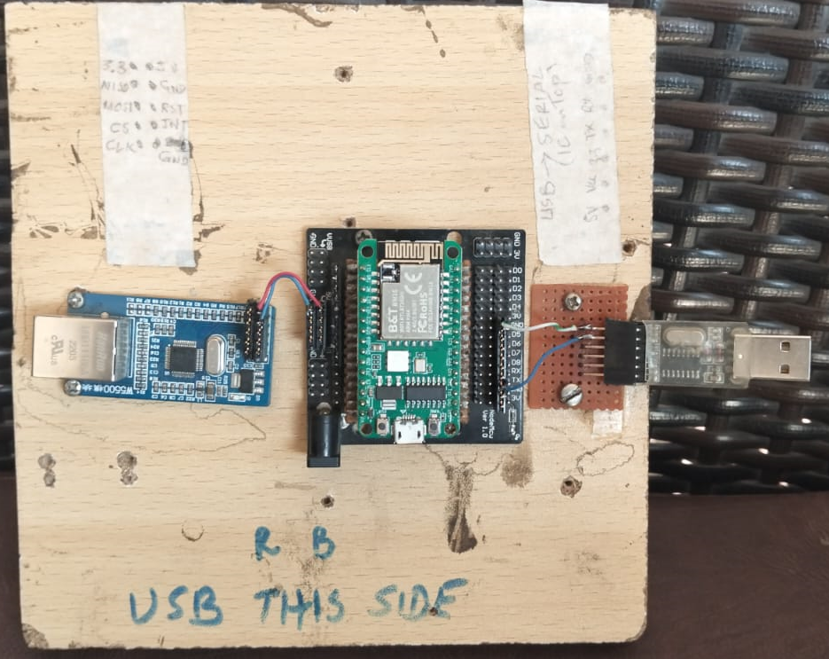

# Activity_Log.md

## 2 Nov 2025 — Hardware Integration Setup
- Mounted **BW16 (RTL8720DN)**, **W5500 Ethernet module**, and **USB-Serial adapter** on the test board.  
- Successfully connected USB-Serial interface for firmware upload testing.  
- Next steps (scheduled for **3 Nov**):  
  - Upload **Blink.ino** to confirm firmware communication.  
  - Connect SPI lines to W5500 for Ethernet validation.  
- Reference image:  
  

# Activity_Log.md

## 26 Oct 2025
Initial groundwork completed.  
Successful compilation of `Ethernet3_BW16` stub verified with Realtek BW16 (Ameba-D) SDK v3.1.9.  
Proof of concept confirmed for Ethernet library recognition.

---
*(Future updates will document hardware testing, ping validation, and PCB design milestones.)*
